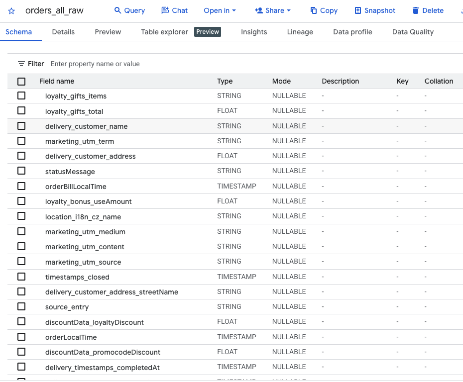
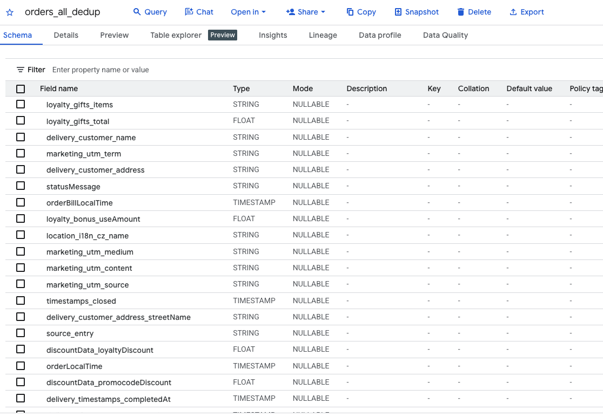
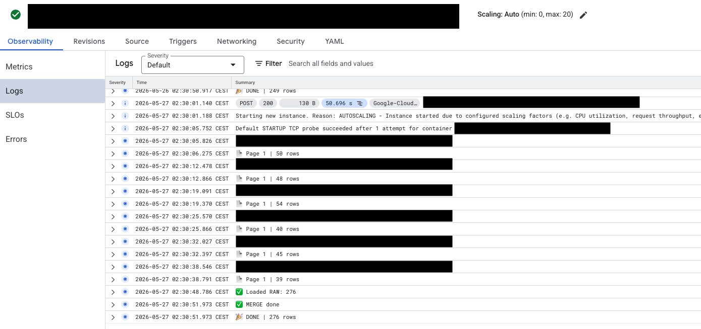

# ChoiceQR Orders Pipeline

Automated restaurant analytics ETL pipeline built with Python, Google Cloud, BigQuery, and Looker Studio.

## Overview

This project extracts restaurant order data from the ChoiceQR API, processes and stores it in BigQuery, and prepares analytical tables for BI dashboards and operational reporting.

The pipeline is designed to support multiple restaurant locations and automated daily data loading.

---

## Tech Stack

- Python
- Google BigQuery
- Google Cloud Run
- SQL
- REST API
- Pandas
- Looker Studio

---

## Features

- Automated API data extraction
- Pagination handling
- Multi-restaurant support
- Incremental loading
- Raw and deduplicated tables
- BigQuery integration
- Dashboard-ready data model
- Rate-limit handling
- Automated cloud execution

---

## Architecture

ChoiceQR API → Python ETL → BigQuery → Looker Studio

---

## Main Tables

| Table | Description |
|---|---|
| orders_all_raw | Raw data loaded directly from API |
| orders_all_dedup | Clean deduplicated analytical table |

---

## Example Metrics

- Orders
- Revenue
- First-time customers
- Cancelled orders
- Delivery time
- Restaurant performance
- Customer retention

---

## Project Structure

```text
choiceqr-orders-pipeline/
│
├── main.py
├── requirements.txt
├── README.md
│
├── sql/
├── docs/
└── screenshots/

```

---

## Future Improvements

- Docker support
- CI/CD pipeline
- Automated scheduling
- Monitoring and alerting
- Data quality checks
- dbt transformations

---

## Author

Ruslan Panteleev

---

## BigQuery Tables

### Raw Orders Table



### Deduplicated Orders Table



---

## Cloud Run Deployment


